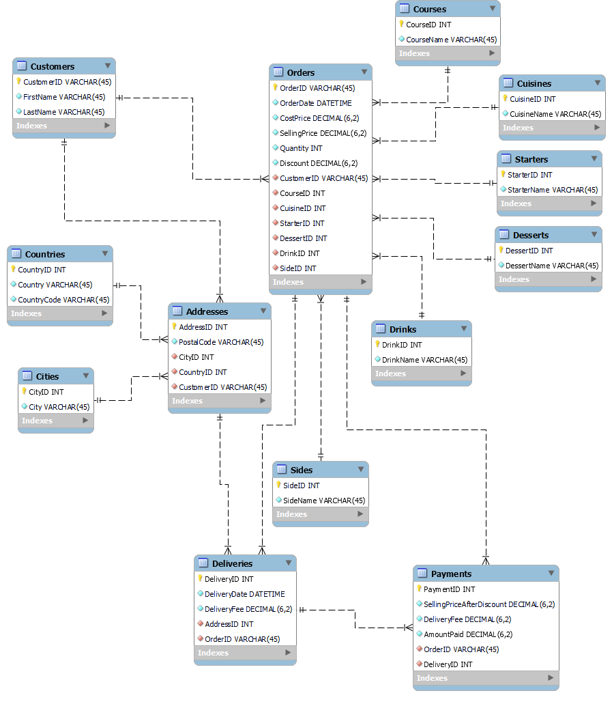

# Little Lemon: Rebuilding A Modern Restaurant's Data Infrastructure

## Introduction

In this scenario, I have been contracted by the owners of Little Lemon, an intercontinental restaurant that makes exquisite meals and does food deliveries, to help migrate their data storage from Microsoft Excel to a relational database management system. The decision was to use MySQL, its being open-source, scalable, widely used, and easy to integrate with their existing frontend application.

## Understanding Little Lemon Existing Data

The [Excel worksheet which contained Little Lemon existing data](LittleLemon_data.xlsx) has 21001 rows and 21 columns. The first row contained column headings, thus there are 21000 observations or records. A description of the data contained in each column is provided below:

- `Row Number`: a serial number for each record in the sheet.
- `Order ID`: a unique string for each order placed by customers.
- `Order Date`: the date the order was made.
- `Delivery Date`: the date the customer got (or should expect to get) their order.
- `Customer ID`: a unique string identifying each customer.
- `Customer Name`: the full name of the customer, a string.
- `City`: a string containing the city name where the delivery should be made at.
- `Country`: the name of the country the order should be delivered to.
- `Postal Code`: the postal code for the delivery, a string.
- `Country Code`: the country code for the delivery country, a string.
- `Cost`: how much, in dollars, it costs to put together the order, a decimal.
- `Sales`: how much, in dollars, everything in the order will be sold for, a decimal.
- `Quantity`: how many of the items in the order the customer wants, an integer.
- `Discount`: the discount given on the order in dollars, a decimal.
- `Delivery Cost`: the charge on the delivery in dollars, a decimal.
- `Course Name`: the name of the main dish of the meal, a string.
- `Cuisine Name`: the name of the meal preparation style the customer wants their meal in, a string.
- `Starter Name`: the name of the first course of the meal, a string.
- `Desert Name` (sic): the name of the last course of the meal, a string.
- `Drink`: the name of the drink for the meal, a string.
- `Sides`: the name of the side dish, a string.

Having a good understanding of the data you're working with is foundational to building an excellent data model.

## Data Modeling

I used MySQL Workbench to create the entity relationship (ER) model for Little Lemon. The ER diagram is as illustrated below.



I used MySQL Workbench forward engineer feature to generate the database and its associated tables and constraints from the data model I designed.


You can review the [SQL code generated with the forward engineer feature here.](littlelemon_forward_engineer.sql)

## Extract, Transform, and Load (ETL) Pipeline

### Data Extraction

In order to extract data from the Excel worksheet and use it to populate the tables in the `littlelemon` database I just created, first, I cleaned the data by checking for null values in all columns and trimming leading and trailing whitespaces.

Thereafter, I created a base table to house the data as it is. This is the table from which the tables in our data model will be populated. The SQL statement to create this base table is written below:

```sql
CREATE TABLE IF NOT EXISTS base_table (
    RowNumber INT NOT NULL PRIMARY KEY AUTO_INCREMENT,
    OrderID VARCHAR(45) NOT NULL,
    OrderDate DATE NOT NULL,
    DeliveryDate DATE NOT NULL,
    CustomerID VARCHAR(45) NOT NULL,
    CustomerName VARCHAR(45) NOT NULL,
    City VARCHAR(45) NOT NULL,
    Country VARCHAR(45) NOT NULL,
    PostalCode VARCHAR(45) NOT NULL,
    CountryCode VARCHAR(10) NOT NULL,
    Cost DECIMAL(6,2) NOT NULL,
    Sales DECIMAL(6,2) NOT NULL,
    Quantity INT NOT NULL,
    Discount DECIMAL(6,2) NOT NULL,
    DeliveryCost DECIMAL(6,2) NOT NULL,
    CourseName VARCHAR(45) NOT NULL,
    CuisineName VARCHAR(45) NOT NULL,
    StarterName VARCHAR(45) NOT NULL,
    DessertName VARCHAR(45) NOT NULL,
    Drink VARCHAR(45) NOT NULL,
    Sides VARCHAR(45) NOT NULL
) ENGINE=InnoDB;
```

While I adopted a Pascal Case naming convention for the tables and columns in the data model, the decision to use Snake Case for this table name was intentional: to differentiate it from tables in the data model at a glance.  Table columns retained the Pascal Case naming convention, and column names are comparable to those in the Excel sheet. Each column has a data type similar to the one mentioned in the description provided above for the columns in the Excel sheet. The column constraints are self descriptive.

Before one can use the `LOAD DATA` statement to import data into a MySQL table, the file must be in a text format. Thus, I converted the Excel sheet into a csv file. I then used the `@@secure_file_priv` variable to find out the specific location on the server host I must place this file. Putting the file anywhere else will result in an error when the `LOAD DATA` statement is executed.


Having ticked all the pre-requisites to run the `LOAD DATA` statement successfully, I ran this SQL code:

```sql
LOAD DATA INFILE 'C:/ProgramData/MySQL/MySQL Server 8.0/Uploads/LittleLemon_data.csv'
INTO TABLE base_table
FIELDS TERMINATED BY ','
ENCLOSED BY '"'
LINES TERMINATED BY '\n'
IGNORE 1 ROWS
(
    RowNumber, OrderID, @OrderDate, @DeliveryDate, CustomerID, CustomerName, City, Country, 
    PostalCode, CountryCode, Cost, Sales, Quantity, Discount, DeliveryCost, CourseName, 
    CuisineName, StarterName, DessertName, Drink, Sides
)
SET OrderDate = STR_TO_DATE(@OrderDate, '%m/%d/%Y'), 
DeliveryDate = STR_TO_DATE(@DeliveryDate, '%m/%d/%Y');
```

Remember that the Excel sheet has column headings? Since I do not want to import the column headings, the statement above contained the clause, `IGNORE 1 ROWS`. If you're wondering, the syntax is really `IGNORE 1 ROWS` with `ROWS` in plural: SQL isn't English. The SQL standard requires dates to be in the format `YYYY-MM-DD`, but the csv file has date columns in the format `MM/DD/YYYY`. I could have used Excel to change the date format from `MM/DD/YYYY` to `YYYY-MM-DD`, but I opted to use SQL, because the steps to doing this are easier to reproduce and also to demonstrate the depth of my knowledge of SQL. All I had to do was specify the column names in brackets and use the `SET` syntax to change the value in the date columns from `MM/DD/YYYY` to `YYYY-MM-DD` with the aid of the `STR_TO_DATE()` function.

All 21,000 records were successfully loaded into the base table. Notably, it is also possible to use MySQL Workbench to import data from a csv file into a table with the added advantage that you do not have to create the table beforehand. Notwithstanding, in my experience, running the `LOAD DATA` statement from the command client is by far faster than using the Workbench. I once attempted to load a file with 1 million records using the Workbench. The process took several hours, I went for lunch and came back and it never completed. I had to terminate the operation. But it only took some seconds when I executed the `LOAD DATA` statement in the command client.

