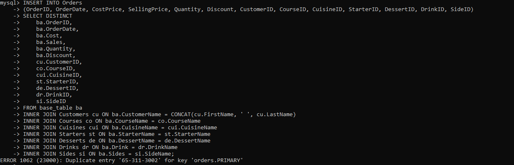

# Little Lemon: Rebuilding A Modern Restaurant's Data Infrastructure

## Introduction

In this scenario, I have been contracted by the owners of Little Lemon, an intercontinental restaurant that makes exquisite meals and does food deliveries, to help migrate their data storage from Microsoft Excel to a relational database management system. The consensus was to use MySQL, it being open-source, scalable, widely used, and easy to integrate with their existing frontend application.

## Understanding Little Lemon Existing Data

The [Excel worksheet which contained Little Lemon existing data](LittleLemon_data.xlsx) has 21001 rows and 21 columns. The first row contained column headings, thus there are 21000 observations or records. A description of the data contained in each column is provided below:

- `Row Number`: a serial number for each record in the sheet.
- `Order ID`: a unique string for each order placed by customers.
- `Order Date`: the date the order was made.
- `Delivery Date`: the date the customer got (or should expect to get) their order.
- `Customer ID`: a unique string identifying each customer.
- `Customer Name`: the full name of the customer, a string.
- `City`: a string containing the city name where the delivery should be made at.
- `Country`: the name of the country the order should be delivered to.
- `Postal Code`: the postal code for the delivery, a string.
- `Country Code`: the country code for the delivery country, a string.
- `Cost`: how much, in dollars, it costs to put together the order, a decimal.
- `Sales`: how much, in dollars, everything in the order will be sold for, a decimal.
- `Quantity`: how many of the items in the order the customer wants, an integer.
- `Discount`: the discount given on the order in dollars, a decimal.
- `Delivery Cost`: the charge on the delivery in dollars, a decimal.
- `Course Name`: the name of the main dish of the meal, a string.
- `Cuisine Name`: the name of the meal preparation style the customer wants their meal in, a string.
- `Starter Name`: the name of the first course of the meal, a string.
- `Desert Name` (sic): the name of the last course of the meal, a string.
- `Drink`: the name of the drink for the meal, a string.
- `Sides`: the name of the side dish, a string.

Having a good understanding of the data you're working with is foundational to building an excellent data model.

## Data Modeling

I used MySQL Workbench to create the entity relationship (ER) model for Little Lemon. The ER diagram is as illustrated below.


I used MySQL Workbench forward engineer feature to generate the database and its associated tables and constraints from the data model I designed.


You can review the [SQL code generated with the forward engineer feature here.](littlelemon_forward_engineer.sql)

## Extract, Transform, and Load (ETL) Pipeline

### Data Extraction

In order to extract data from the Excel worksheet and use it to populate the tables in the `littlelemon` database I just created, first, I cleaned the data by checking for null values in all columns and trimming leading and trailing whitespaces.

Thereafter, I created a base table to house the data as it is. This is the table from which the tables in our data model will be populated. The SQL statement to create this base table is written below:

```sql
CREATE TABLE IF NOT EXISTS base_table (
    RowNumber INT NOT NULL PRIMARY KEY AUTO_INCREMENT,
    OrderID VARCHAR(45) NOT NULL,
    OrderDate DATE NOT NULL,
    DeliveryDate DATE NOT NULL,
    CustomerID VARCHAR(45) NOT NULL,
    CustomerName VARCHAR(45) NOT NULL,
    City VARCHAR(45) NOT NULL,
    Country VARCHAR(45) NOT NULL,
    PostalCode VARCHAR(45) NOT NULL,
    CountryCode VARCHAR(10) NOT NULL,
    Cost DECIMAL(6,2) NOT NULL,
    Sales DECIMAL(6,3) NOT NULL,
    Quantity INT NOT NULL,
    Discount DECIMAL(6,2) NOT NULL,
    DeliveryCost DECIMAL(6,2) NOT NULL,
    CourseName VARCHAR(45) NOT NULL,
    CuisineName VARCHAR(45) NOT NULL,
    StarterName VARCHAR(45) NOT NULL,
    DessertName VARCHAR(45) NOT NULL,
    Drink VARCHAR(45) NOT NULL,
    Sides VARCHAR(45) NOT NULL
) ENGINE=InnoDB,CHARSET=utf8mb4;
```

While I adopted a Pascal Case naming convention for the tables and columns in the data model, the decision to use Snake Case for this table name was intentional: to differentiate it from tables in the data model at a glance.  Table columns retained the Pascal Case naming convention, and column names are comparable to those in the Excel sheet. Each column has a data type similar to the one mentioned in the description provided above for the columns in the Excel sheet. The column constraints are self descriptive.

Before one can use the `LOAD DATA` statement to import data into a MySQL table, the file must be in a text format. Thus, I converted the Excel sheet into a csv file. I then used the `@@secure_file_priv` variable to find out the specific location on the server host I must place this file. Putting the file anywhere else will result in an error when the `LOAD DATA` statement is executed.


Having ticked all the pre-requisites to run the `LOAD DATA` statement successfully, I ran this SQL code:

```sql
LOAD DATA INFILE 'C:/ProgramData/MySQL/MySQL Server 8.0/Uploads/LittleLemon_data.csv'
INTO TABLE base_table
FIELDS TERMINATED BY ','
ENCLOSED BY '"'
LINES TERMINATED BY '\n'
IGNORE 1 ROWS
(
    RowNumber, OrderID, @OrderDate, @DeliveryDate, CustomerID, CustomerName, City, Country, 
    PostalCode, CountryCode, Cost, Sales, Quantity, Discount, DeliveryCost, CourseName, 
    CuisineName, StarterName, DessertName, Drink, Sides
)
SET OrderDate = STR_TO_DATE(@OrderDate, '%m/%d/%Y'), 
DeliveryDate = STR_TO_DATE(@DeliveryDate, '%m/%d/%Y');
```

Remember that the Excel sheet has column headings? Since I do not want to import the column headings, the statement above contained the clause, `IGNORE 1 ROWS`. If you're wondering, the syntax is really `IGNORE 1 ROWS` with `ROWS` in plural: SQL isn't English. The SQL standard requires dates to be in the format `YYYY-MM-DD`, but the csv file has date columns in the format `MM/DD/YYYY`. I could have used Excel to change the date format from `MM/DD/YYYY` to `YYYY-MM-DD`, but I opted to use SQL, because the steps to doing this are easier to reproduce and also to show you the extent of what is possible with this statement. All I had to do was specify the column names in brackets and use the `SET` syntax to change the value in the date columns from `MM/DD/YYYY` to `YYYY-MM-DD` with the aid of the `STR_TO_DATE()` function.

All 21,000 records were successfully loaded into the base table. Notably, it is also possible to use MySQL Workbench to import data from a csv file into a table with the added advantage that you do not have to create the table beforehand. Notwithstanding, in my experience, running the `LOAD DATA` statement from the command client is by far faster than using the Workbench. I once attempted to load a file with 1 million records using the Workbench. The process took several hours, I went for lunch and came back and it never completed. I had to terminate the operation. But it only took some seconds when I executed the `LOAD DATA` statement in the command client.


### Data Transformation and Loading

Now that the base table had been created and populated with data from the Excel sheet, it was time to fill up the tables in the Little Lemon newly created schema with data starting from the `Customers` table. I selected unique customers' data from relevant columns in the base table and inserted same into the `Customers` table:

```sql
INSERT INTO Customers (CustomerID, FirstName, LastName)
SELECT DISTINCT CustomerID, SUBSTRING_INDEX(CustomerName, ' ', 1), SUBSTRING_INDEX(CustomerName, ' ', -1)
FROM base_table;
```

The output of running the above query showed that there were 1,000 unique customers.


You may choose the inspect a few rows from the `Customers` table by running:

```sql
SELECT CustomerID, FirstName, LastName FROM Customers LIMIT 10;
```

Notice how I listed the column names I was interested in retrieving in the query above as opposed to writing a `SELECT *` statement? This is an optimization technique that improves the performance of queries. 


> [!TIP]
> Avoid using `SELECT *` statements in production.

I ran similar `INSERT INTO SELECT` statements to insert data into `Countries`, `Cities`, `Courses`, `Cuisines`, `Starters`, `Desserts`, `Drinks`, and `Sides` - tables with no foreign key constraints. You can review the [SQL code here.](queries.sql#L61)

The `Addresses` table has foreign key constraints on it and so, a simple `INSERT INTO SELECT` statement would not be adequate to populate this table with existing data. What I did was add multiple `INNER JOIN` clauses to retrieve data from relevant tables based on common column values and insert the data into the `Addresses` table.

```sql
INSERT INTO Addresses (PostalCode, CityID, CountryID, CustomerID)
SELECT DISTINCT
    ba.PostalCode, 
    ci.CityID, 
    co.CountryID, 
    cu.CustomerID
FROM base_table ba
INNER JOIN Cities ci ON ba.City = ci.City
INNER JOIN Countries co ON ba.Country = co.Country
INNER JOIN Customers cu ON ba.CustomerName = CONCAT(cu.FirstName, ' ', cu.LastName);  
```

A similar operation was done to insert data into the `Orders` table:

```sql
INSERT INTO Orders 
(OrderID, OrderDate, CostPrice, SellingPrice, Quantity, Discount, CustomerID, CourseID, CuisineID, StarterID, DessertID, DrinkID, SideID)
SELECT DISTINCT
    ba.OrderID,
    ba.OrderDate,
    ba.Cost,
    ba.Sales,
    ba.Quantity,
    ba.Discount,
    cu.CustomerID,
    co.CourseID,
    cui.CuisineID,
    st.StarterID,
    de.DessertID,
    dr.DrinkID,
    si.SideID
FROM base_table ba
INNER JOIN Customers cu ON ba.CustomerName = CONCAT(cu.FirstName, ' ', cu.LastName)
INNER JOIN Courses co ON ba.CourseName = co.CourseName
INNER JOIN Cuisines cui ON ba.CuisineName = cui.CuisineName
INNER JOIN Starters st ON ba.StarterName = st.StarterName
INNER JOIN Desserts de ON ba.DessertName = de.DessertName
INNER JOIN Drinks dr ON ba.Drink = dr.DrinkName
INNER JOIN Sides si ON ba.Sides = si.SideName;
```

However, running the query above will fail with a duplicate key error.



Let's inspect the base table for the `OrderID` in the error message to gain more insights:

```sql
SELECT * FROM base_table
WHERE OrderID = '65-311-3002';
```

Wait a minute! Did I not just tell you to avoid using `SELECT *` statements? Why then did I just use it? What I actually said was that you should not use it in production environment. It is okay to use it during development for a testing or debugging purpose such as this. 

I reached this conclusion when I inspected the output: A customer may have multiple entries in the `Orders` table with the same `OrderID` if the orders are made at the same time but they are sent to different delivery addresses. To use an example,  a customer may buy 10 cheesecakes at the same time but send 2 each to 5 different locations (`PostalCode`) for delivery. The orders will have the same `OrderID`. Thus, it is imperative to use a composite primary key for the `Orders` table that will consist of the `OrderID` and the `PostalCode`. In order to do this, I'd have to drop the existing primary key (after dropping the foreign key constraints on tables referencing this column) and then add a new one.

```sql
-- Drop foreign key constraints on tables referencing Orders.OrderID
ALTER TABLE Deliveries DROP FOREIGN KEY deliveries_order_id_fk;

ALTER TABLE Payments DROP FOREIGN KEY payments_order_id_fk;

-- See the arrangement of columns in the Orders table
SHOW COLUMNS FROM Orders;

-- Add a new column after OrderID column
ALTER TABLE Orders ADD COLUMN PostalCode VARCHAR(45) NOT NULL AFTER OrderID;

-- Confirm that the new column was placed after the OrderID column
SHOW COLUMNS FROM Orders;

-- Drop existing primary key
ALTER TABLE Orders DROP PRIMARY KEY; 

-- Add a composite primary key
ALTER TABLE Orders ADD PRIMARY KEY (OrderID, PostalCode);

-- Recreate the foreign key constraints on relevant tables
ALTER TABLE Deliveries ADD CONSTRAINT deliveries_order_id_fk FOREIGN KEY (OrderID) REFERENCES Orders(OrderID) ON DELETE CASCADE ON UPDATE CASCADE;

ALTER TABLE Payments ADD CONSTRAINT payments_order_id_fk FOREIGN KEY (OrderID) REFERENCES Orders(OrderID) ON DELETE CASCADE ON UPDATE CASCADE;

-- Rerun the modified query to insert data into the Orders table
INSERT INTO Orders 
(OrderID, PostalCode, OrderDate, CostPrice, SellingPrice, Quantity, Discount, CustomerID, CourseID, CuisineID, StarterID, DessertID, DrinkID, SideID)
SELECT DISTINCT
    ba.OrderID,
    ba.PostalCode,
    ba.OrderDate,
    ba.Cost,
    ROUND(ba.Sales, 2),
    ba.Quantity,
    ba.Discount,
    cu.CustomerID,
    co.CourseID,
    cui.CuisineID,
    st.StarterID,
    de.DessertID,
    dr.DrinkID,
    si.SideID
FROM base_table ba
INNER JOIN Customers cu ON ba.CustomerName = CONCAT(cu.FirstName, ' ', cu.LastName)
INNER JOIN Courses co ON ba.CourseName = co.CourseName
INNER JOIN Cuisines cui ON ba.CuisineName = cui.CuisineName
INNER JOIN Starters st ON ba.StarterName = st.StarterName
INNER JOIN Desserts de ON ba.DessertName = de.DessertName
INNER JOIN Drinks dr ON ba.Drink = dr.DrinkName
INNER JOIN Sides si ON ba.Sides = si.SideName;
```


Without further ado, let's also insert data into the `Deliveries` and `Payments` tables:

```sql
-- Insert data into Deliveries table
INSERT INTO Deliveries (DeliveryDate, DeliveryFee, AddressID, OrderID)
SELECT
    ba.DeliveryDate,
    ba.DeliveryCost,
    ad.AddressID,
    `or`.OrderID
FROM base_table ba
INNER JOIN Addresses ad ON ba.PostalCode = ad.PostalCode AND ba.CustomerID = ad.CustomerID
INNER JOIN Orders `or` ON ba.PostalCode = `or`.PostalCode AND ba.OrderID = `or`.OrderID;

-- Insert data into Payments table
INSERT INTO Payments (SellingPriceAfterDiscount, DeliveryFee, AmountPaid, OrderID, DeliveryID)
SELECT
    (ROUND(ba.Sales, 2) - ba.Discount),
    ba.DeliveryCost,
    (ROUND(ba.Sales, 2) - ba.Discount + ba.DeliveryCost),
    `or`.OrderID,
    de.DeliveryID
FROM base_table ba
INNER JOIN Orders `or` ON ba.PostalCode = `or`.PostalCode AND ba.OrderID = `or`.OrderID
INNER JOIN Addresses ad ON ba.PostalCode = ad.PostalCode AND ba.CustomerID = ad.CustomerID
INNER JOIN Deliveries de ON `or`.OrderID = de.OrderID AND ad.AddressID = de.AddressID;
```

And so, in many steps, I have extracted data from the data source, transformed it into suitable data types, and loaded it into many tables in a MySQL database.

## Data Analysis And Visualization With Tableau

The owners of Little Lemon are interested in learning how their business is doing in the United States.

### Who are the top customers with total purchases worth $70 or more?

The bar chart below shows top customers who have made orders whose sum is at least $70.

<div class='tableauPlaceholder' id='viz1711704134094' style='position: relative'><noscript><a href='#'></a></noscript><object class='tableauViz'  style='display:none;'><param name='host_url' value='https%3A%2F%2Fpublic.tableau.com%2F' /> <param name='embed_code_version' value='3' /> <param name='site_root' value='' /><param name='name' value='LittleLemonSalesandProfits&#47;Customerssales' /><param name='tabs' value='no' /><param name='toolbar' value='yes' /><param name='static_image' value='https:&#47;&#47;public.tableau.com&#47;static&#47;images&#47;Li&#47;LittleLemonSalesandProfits&#47;Customerssales&#47;1.png' /> <param name='animate_transition' value='yes' /><param name='display_static_image' value='yes' /><param name='display_spinner' value='yes' /><param name='display_overlay' value='yes' /><param name='display_count' value='yes' /><param name='language' value='en-US' /></object></div>                

<script type='text/javascript'>                    var divElement = document.getElementById('viz1711704134094');                    var vizElement = divElement.getElementsByTagName('object')[0];                    vizElement.style.width='100%';vizElement.style.height=(divElement.offsetWidth*0.75)+'px';                    var scriptElement = document.createElement('script');                    scriptElement.src = 'https://public.tableau.com/javascripts/api/viz_v1.js';                    vizElement.parentNode.insertBefore(scriptElement, vizElement);                </script>

